# PostgreSQL HA Cluster Setup Using Patroni

|Author: | MD OBAIDUL HAQUE SARKER |    
|:-----------|:-------------------------|
| Email:    | aupo37@gmail.com         |
| LinkedIn: | https://www.linkedin.com/in/md-obaidul-haque-sarker-5b983b26 |
| Github: | https://github.com/obaidulsarker |
| Created On: | 04-May-2025 |
| Updated On: | 05-May-2025 |


## 1.	Introduction

Patroni is a cluster manager that can customize and automate the deployment and maintenance of PostgreSQL HA (High Availability) clusters. It ensures that PostgreSQL databases remain operational and resilient to failures. Patroni works by utilizing a distributed consensus mechanism to manage the configuration and state of a PostgreSQL cluster, facilitating automatic failover in case of primary node failures.

## 2. Deployment Architecture

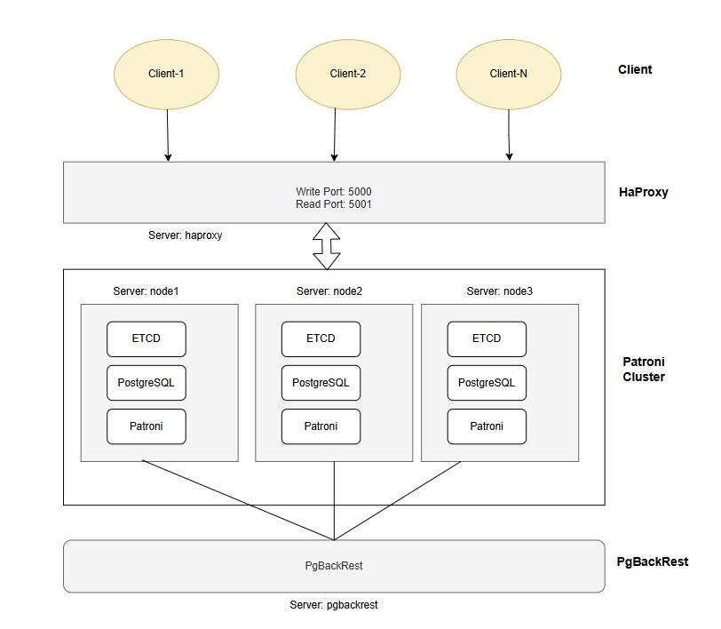
<center>Figure: Deployment diagram of Patroni cluster</center>
</br> </br>
- <strong>Patroni’s architecture</strong> consists of multiple PostgreSQL nodes that handle tasks such as load balancing, automatic failover, and replication. A typical Patroni architecture includes the following components:</br> </br>
<strong>PostgreSQL</strong> are database nodes.</br> </br>
<strong> Patroni </strong> uses etcd, Consul, or ZooKeeper to maintain a consistent view of the cluster state.  These tools ensure that only one node is elected as the primary, even if there are network partitions. </br> </br>
<strong> ETCD </strong> is a strongly consistent, distributed key-value store that provides a reliable way to store data that a distributed system or cluster of machines needs to access. It is used for DCS (Distributed Configuration Store). Use Etcd to store the state of the PostgreSQL cluster to keep the Postgres cluster up and running.
</br> </br>
<strong>Consul</strong> is a service networking solution that enables teams to manage secure network connectivity between services and across on-prem and multi-cloud environments and runtimes. Consul offers service discovery, service mesh, traffic management, and automated updates to network infrastructure devices. It can be used with Patroni as a DCS for PostgreSQL high availability. Patroni utilizes Consul to manage the cluster configuration, including leader election and failover mechanisms.
</br> </br>
<strong> HAProxy </strong> is a load balancer offers load balancing and proxying for TCP and HTTP-based applications.
</br> </br>
<strong> PgBackRest </strong> is robust tool used for backup and recovery processes.

### Server Information
| Host Name|	IP Address|	OS	| Purpose |
|---------| ----------| ------| ----------|
| node1 |	192.168.17.133 |	AlmaLinux 9.5	| PostgreSQL, ETCD, Patroni |
| node2	| 192.168.17.134	| AlmaLinux 9.5 |	PostgreSQL, ETCD, Patroni |
| node3 |	192.168.17.135 |	AlmaLinux 9.5	| PostgreSQL, ETCD, Patroni |
| haproxy |	192.168.17.136 |	AlmaLinux 9.5 |	Database load balancing | 
| pgbackrest |	192.168.17.137 |	AlmaLinux 9.5 |	Backup and recovery tool |

### Service Information
| Service Name | version |	Port |	Purpose |
|-------------- | ------|-------- |-----------|
| ETCD |	3.5 |2379, 2380 |	2379 = Etcd client communication </br> 2380 = Etcd peer-to-peer communication (cluster members)  |
| Patroni REST API | 4.0 |	8008 |	REST API used by Patroni for health checks, failover, etc. |
| PostgreSQL | 17.4 |	5432 |	Main PostgreSQL database port |
| HAProxy	| 2.4 |5000, 5001 |	5000 = Client connection for read/write </br> 5001 = Client connection for read-only |

## 3.	Installation
### 3.1	Pre-requisites
- On all servers, disable the SELinux and firewall.</br>
  ```
  vi /etc/selinux/config
  ```
| SELINUX=disabled |
|------------------|

Press :x to save the file.

```
sudo systemctl stop firewalld  
sudo systemctl disable firewalld
reboot now
```
- On all servers, update the hostname according to below information.</br>
In 192.168.17.133 server,
```
vi /etc/hosts
```
</br>

```
192.168.17.133 node1 
192.168.17.134 node2  
192.168.17.135 node3  
192.168.17.136 haproxy  
192.168.17.137 pgbackrest
```
*** Repeat above step on all servers to change the hostname.

### Install PostgreSQL on all of servers except haproxy without initializing the database.
- Install the repository RPM.
  ```
  sudo dnf install -y https://download.postgresql.org/pub/repos/yum/reporpms/EL-9-x86_64/pgdg-redhat-repo-latest.noarch.rpm
  ```
- Disable the built-in PostgreSQL module.
  ```
  sudo dnf -qy module disable postgresql
  ```
- Install PostgreSQL.
  ```
  sudo dnf install -y postgresql17-server postgresql17-contrib
  ```

### 3.2 Activate SSH trust among nodes using postgres user.
- For example, SSH trust from node1 to node2, node3 and pgbackrest servers.
  - Set postgres user ssh password.
    ```
    sudo passwd postgres
    ```
    Remember postgres system passowrd.
    
  - Generate SSH keys on all nodes with postgres user.
    ```
    su - postgres
    ssh-keygen
    ```
  - Copy SSH keys from source to destination servers. For example, copy ssh public key from node1 to node2, node3 and pgbackrest servers.
   ```
    ssh-copy-id postgres@node2
    ssh-copy-id postgres@node3
    ssh-copy-id postgres@pgbackrest
  ```
   *** Repeat above step for other servers.

### 3.3 Install and Configure the ETCD cluster
#### Setup ETCD on node1, node2 and node3 nodes and follow the steps outlined below.
```
wget https://github.com/etcd-io/etcd/releases/download/v3.5.0/etcd-v3.5.0-linux-amd64.tar.gz
dnf install -y tar
tar -xvf etcd-v3.5.0-linux-amd64.tar.gz
ls -la
cd etcd-v3.5.0-linux-amd64
ls -la
```
- Copy etcdctl binary to /usr/bin directory.
  ```
  cp etcd etcdctl etcdutl /usr/bin
  ```
- Create an etcd user and group specifically for running etcd binaries.
  ```
  groupadd --system etcd
  useradd -s /bin/bash --system -g etcd etcd
  ```
- Create data and configuration directories, and give permission on created directories.
  ```
  sudo mkdir -p /var/lib/etcd/
  sudo mkdir /etc/etcd
  sudo chown -R etcd:etcd /var/lib/etcd/
  sudo chown -R etcd:etcd  /etc/etcd
  chmod 0775 /var/lib/etcd/
  ```
  
- Add environment variables on node1 server.
  ```
  vi .bash_profile
  ```
  </br>
  
  ```
  ETCDCTL_API=3
  NODE1=192.168.17.133
  NODE2=192.168.17.134
  NODE3=192.168.17.135
  
  ENDPOINTS=$NODE1:2379,$NODE2:2379,$NODE3:2379
  PATRONI_CONFIG_LOCATION=/etc/patroni/patroni.yml
  ```
- Activate environment variables.

  ```
  source .bash_profile
  ```
- Add environment variables on node2 server.
  ```
  vi .bash_profile
  ```
  
  ```
  ETCDCTL_API=3
  NODE1=192.168.17.133
  NODE2=192.168.17.134
  NODE3=192.168.17.135
  
  ENDPOINTS=$NODE1:2379,$NODE2:2379,$NODE3:2379
  
  PATRONI_CONFIG_LOCATION=/etc/patroni/patroni.yml
  ```

  - Activate environment variables.
    ```
    source .bash_profile
    ```

- Add environment variables on node3 server.
  ```
  vi .bash_profile
  ```

  ```
  ETCDCTL_API=3
  NODE1=192.168.17.133
  NODE2=192.168.17.134
  NODE3=192.168.17.135
  ENDPOINTS=$NODE1:2379,$NODE2:2379,$NODE3:2379
  PATRONI_CONFIG_LOCATION=/etc/patroni/patroni.yml
  ```

  - Activate environment variables.
    ```
    source .bash_profile
    ```
- Create the ETCD systemd service on node1, node2 and node3 servers. </br>
  - On node1 server,

    ```
    vi /etc/systemd/system/etcd.service
    ``` 

    ```
    [Unit]
    Description=etcd key-value store
    Documentation=https://github.com/etcd-io/etcd
    After=network.target
    
    [Service]
    User=etcd
    Type=notify
    Environment=ETCD_DATA_DIR=/var/lib/etcd
    Environment=ETCD_NAME=node1
    Environment=ETCD_LISTEN_PEER_URLS="http://192.168.17.133:2380"
    Environment=ETCD_LISTEN_CLIENT_URLS="http://192.168.17.133:2379,http://127.0.0.1:2379"
    Environment=ETCD_INITIAL_ADVERTISE_PEER_URLS="http://192.168.17.133:2380"
    Environment=ETCD_INITIAL_CLUSTER="node1=http://192.168.17.133:2380,node2=http://192.168.17.134:2380,node3=http://192.168.17.135:2380"
    Environment=ETCD_ADVERTISE_CLIENT_URLS="http://192.168.17.133:2379"
    Environment=ETCD_INITIAL_CLUSTER_TOKEN="etcdcluster"
    Environment=ETCD_INITIAL_CLUSTER_STATE="new"
    ExecStart=/usr/bin/etcd --enable-v2=true
    Restart=always
    RestartSec=10s
    LimitNOFILE=40000
    
    [Install]
    WantedBy=multi-user.target
    ```

  - On node2 server,
       ```
       vi /etc/systemd/system/etcd.service
       ```
    
       ```
         [Unit]
        Description=etcd key-value store
        Documentation=https://github.com/etcd-io/etcd
        After=network.target
        
        [Service]
        User=etcd
        Type=notify
        Environment=ETCD_DATA_DIR=/var/lib/etcd
        Environment=ETCD_NAME=node2
        Environment=ETCD_LISTEN_PEER_URLS="http://192.168.17.134:2380"
        Environment=ETCD_LISTEN_CLIENT_URLS="http://192.168.17.134:2379,http://127.0.0.1:2379"
        Environment=ETCD_INITIAL_ADVERTISE_PEER_URLS="http://192.168.17.134:2380"
        Environment=ETCD_INITIAL_CLUSTER="node1=http://192.168.17.133:2380,node2=http://192.168.17.134:2380,node3=http://192.168.17.135:2380"
        Environment=ETCD_ADVERTISE_CLIENT_URLS="http://192.168.17.134:2379"
        Environment=ETCD_INITIAL_CLUSTER_TOKEN="etcdcluster"
        Environment=ETCD_INITIAL_CLUSTER_STATE="new"
        ExecStart=/usr/bin/etcd --enable-v2=true
        Restart=always
        RestartSec=10s
        LimitNOFILE=40000
        
        [Install]
        WantedBy=multi-user.target
       ```

  - On node3 server,
      ```
      vi /etc/systemd/system/etcd.service
      ```

      ```
      [Unit]
      Description=etcd key-value store
      Documentation=https://github.com/etcd-io/etcd
      After=network.target
      
      [Service]
      User=etcd
      Type=notify
      Environment=ETCD_DATA_DIR=/var/lib/etcd
      Environment=ETCD_NAME=node3
      Environment=ETCD_LISTEN_PEER_URLS="http://192.168.17.135:2380"
      Environment=ETCD_LISTEN_CLIENT_URLS="http://192.168.17.135:2379,http://127.0.0.1:2379"
      Environment=ETCD_INITIAL_ADVERTISE_PEER_URLS="http://192.168.17.135:2380"
      Environment=ETCD_INITIAL_CLUSTER="node1=http://192.168.17.133:2380,node2=http://192.168.17.134:2380,node3=http://192.168.17.135:2380"
      Environment=ETCD_ADVERTISE_CLIENT_URLS="http://192.168.17.135:2379"
      Environment=ETCD_INITIAL_CLUSTER_TOKEN="etcdcluster"
      Environment=ETCD_INITIAL_CLUSTER_STATE="new"
      ExecStart=/usr/bin/etcd --enable-v2=true
      Restart=always
      RestartSec=10s
      LimitNOFILE=40000

      [Install]
      WantedBy=multi-user.target
      ```
    
  
  - Reload the demon on all ETCD nodes and start the etcd service.

    ```
    systemctl daemon-reload
    systemctl enable etcd
    systemctl start etcd
    systemctl status etcd
    ```

  - Check ETCD endpoint status using etcdctl on any of the etcd node.
 
    ```
    etcdctl endpoint status --write-out=table --endpoints=$ENDPOINTS
    ```
    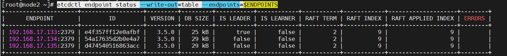

  - Check ETCD endpoint health status using etcdctl on any of the etcd node.
    ```
    etcdctl endpoint health --endpoints=$ENDPOINTS --write-out=table
    ```
    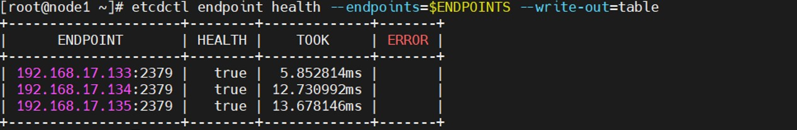
  
### 3.4 Install and configure the Patroni cluster

- #### Set up Patroni on all three nodes (node1, node2 and node3) and proceed with the following steps.
```
dnf install epel-release
sudo yum install python3-pip python3-devel binutils
pip3 install click
dnf install patroni
dnf install python-etcd
systemctl enable patroni

```
- #### Create a configuration file and the necessary directories for Patroni on node1, node2 and node3 servers.
  ```
  mkdir -p /etc/patroni/logs #directory to store logs
  chmod 777 -R /etc/patroni/logs
  touch /etc/patroni/patroni.yml
  chown -R postgres:postgres /etc/patroni

  ```
- #### Create following directories for PostgreSQL data, log and archive log directories on node1, node2 and node3 servers.

  ```
  mkdir -p /data/pgsql
  mkdir -p /log/archive
  mkdir -p /log/pg_log
  chmod 700 -R /data/pgsql
  chmod 700 -R /log/archive
  chmod 700 -R /log/pg_log
  chown postgres:postgres -R /data/pgsql /log/archive /log/pg_log
  ```
- #### On Node1 patroni.yml, configure the patroni.
  ```
  vi /etc/patroni/patroni.yml
  ```

  ```
  scope: pg-ha-cluster
  namespace: '/service'
  name: node1
  
  log:
      traceback_level: INFO
      level: INFO
      dir: /etc/patroni/logs/
      file_num: 5
  
  restapi:
      listen: 0.0.0.0:8008
      connect_address: 192.168.17.133:8008
  etcd3:
      protocol: http
      hosts: 192.168.17.133:2379,192.168.17.134:2379,192.168.17.135:2379
  
  bootstrap:
      dcs:
          ttl: 30
          loop_wait: 10
          retry_timeout: 10
          maximum_lag_on_failover: 1048576
          postgresql:
              use_pg_rewind: true
              use_slots: true
              parameters:
                  wal_keep_segments: 100
                  hot_standby: 'on'
                  max_wal_senders: 10
                  max_replication_slots: 10
                  max_wal_size: '1GB'
                  archive_mode: 'on'
                  archive_timeout: 600s
                  archive_command: 'cp -f %p /log/archive/%f'
                  synchronous_commit: 'on'
                  synchronous_standby_names: 'ANY 1 (node1, node2, node3)'
      initdb:
          - encoding: UTF8
          - data-checksums
      pg_hba:
          - host replication replicator 192.168.17.133/32 md5
          - host replication replicator 192.168.17.134/32 md5
          - host replication replicator 192.168.17.135/32 md5
          - host all all 0.0.0.0/0 md5
  
  postgresql:
      listen: 192.168.17.133:5432
      connect_address: 192.168.17.133:5432
      data_dir: /data/pgsql
      bin_dir: /usr/pgsql-17/bin
      authentication:
          replication:
              username: replicator
              password: replicator
          superuser:
              username: postgres
              password: postgres
  tags:
      nofailover: false
      noloadbalance: false
      clonefrom: false
      nosync: false

  ```
- Start patroni service and check member of cluster on node1.

  ```
    systemctl start patroni
    systemctl status patroni
    patronictl -c /etc/patroni/patroni.yml list pg-ha-cluster
  ```

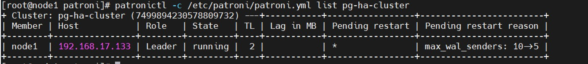

- #### On Node2 patroni.yml, configure the patroni.
  ```
  vi /etc/patroni/patroni.yml
  ```
  ```
  scope: pg-ha-cluster
  namespace: '/service'
  name: node2
  
  log:
      traceback_level: INFO
      level: INFO
      dir: /etc/patroni/logs/
      file_num: 5
  
  restapi:
      listen: 0.0.0.0:8008
      connect_address: 192.168.17.134:8008
  etcd3:
      protocol: http
      hosts: 192.168.17.133:2379,192.168.17.134:2379,192.168.17.135:2379
  
  bootstrap:
      dcs:
          ttl: 30
          loop_wait: 10
          retry_timeout: 10
          maximum_lag_on_failover: 1048576
          postgresql:
              use_pg_rewind: true
              use_slots: true
              parameters:
                  wal_keep_segments: 100
                  hot_standby: 'on'
                  max_wal_senders: 10
                  max_replication_slots: 10
                  max_wal_size: '1GB'
                  archive_mode: 'on'
                  archive_timeout: 600s
                  archive_command: 'cp -f %p /log/archive/%f'
                  synchronous_commit: 'on'
                  synchronous_standby_names: 'ANY 1 (node1, node2, node3)'
      initdb:
          - encoding: UTF8
          - data-checksums
      pg_hba:
          - host replication replicator 192.168.17.133/32 md5
          - host replication replicator 192.168.17.134/32 md5
          - host replication replicator 192.168.17.135/32 md5
          - host all all 0.0.0.0/0 md5
  
  postgresql:
      listen: 192.168.17.134:5432
      connect_address: 192.168.17.134:5432
      data_dir: /data/pgsql
      bin_dir: /usr/pgsql-17/bin
      authentication:
          replication:
              username: replicator
              password: replicator
          superuser:
              username: postgres
              password: postgres
  tags:
      nofailover: false
      noloadbalance: false
      clonefrom: false
      nosync: false
  ```

- Start the patroni service and check member list of the cluster.

```
systemctl start patroni
systemctl status patroni
patronictl -c /etc/patroni/patroni.yml list pg-ha-cluster
```

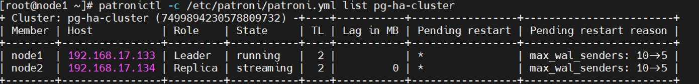

- #### On Node3 patroni.yml, configure the patroni.
```
vi /etc/patroni/patroni.yml
```

```
scope: pg-ha-cluster
namespace: '/service'
name: node3

log:
    traceback_level: INFO
    level: INFO
    dir: /etc/patroni/logs/
    file_num: 5

restapi:
    listen: 0.0.0.0:8008
    connect_address: 192.168.17.135:8008
etcd3:
    protocol: http
    hosts: 192.168.17.133:2379,192.168.17.134:2379,192.168.17.135:2379

bootstrap:
    dcs:
        ttl: 30
        loop_wait: 10
        retry_timeout: 10
        maximum_lag_on_failover: 1048576
        postgresql:
            use_pg_rewind: true
            use_slots: true
            parameters:
                wal_keep_segments: 100
                hot_standby: 'on'
                max_wal_senders: 10
                max_replication_slots: 10
                max_wal_size: '1GB'
                archive_mode: 'on'
                archive_timeout: 600s
                archive_command: 'cp -f %p /log/archive/%f'
                synchronous_commit: 'on'
                synchronous_standby_names: 'ANY 1 (node1, node2, node3)'
    initdb:
        - encoding: UTF8
        - data-checksums
    pg_hba:
        - host replication replicator 192.168.17.133/32 md5
        - host replication replicator 192.168.17.134/32 md5
        - host replication replicator 192.168.17.135/32 md5
        - host all all 0.0.0.0/0 md5

postgresql:
    listen: 192.168.17.135:5432
    connect_address: 192.168.17.135:5432
    data_dir: /data/pgsql
    bin_dir: /usr/pgsql-17/bin
    authentication:
        replication:
            username: replicator
            password: replicator
        superuser:
            username: postgres
            password: postgres
tags:
    nofailover: false
    noloadbalance: false
    clonefrom: false
    nosync: false
```
- Start the patroni service and check the member list on node3 server.

  ```
  systemctl start patroni
  systemctl status patroni
  patronictl -c /etc/patroni/patroni.yml list pg-ha-cluster
  ```
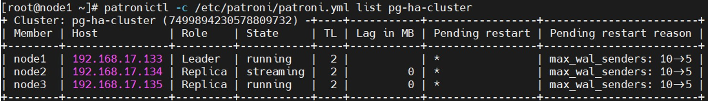

## 4.	Patroni CLI Commands
```
Patroni has a command-line interface named patronict , which is used basically to interact with Patroni’s REST API and with the DCS (Dynamic Configuration Store).
patronictl [ { -c | --config-file } CONFIG_FILE ] [ { -d | --dcs-url | --dcs } DCS_URL ] [ { -k | --insecure } ] SUBCOMMAND
-c / --config-file: provide a path to a configuration file.
-d / --dcs-url / --dcs: provide a connection string to the DCS.
-k / --insecure: Flag to bypass validation of REST API server SSL certificate
```

- patronictl version check version of patroni cluster.
```
patronictl -c /etc/patroni/patroni.yml version pg-ha-cluster
```
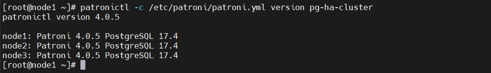

- patronictl edit-config changes the dynamic configuration of the cluster and updates the DCS.
  ```
  patronictl -c /etc/patroni/patroni.yml edit-config pg-ha-cluster --pg max_connections="150" --force
  ```
  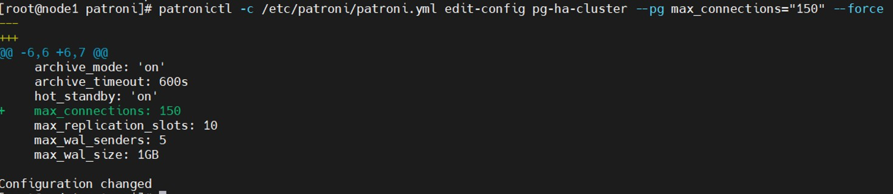

 - patronictl list find the cluster member status.
   ```
   patronictl -c /etc/patroni/patroni.yml list pg-ha-cluster
   ```
   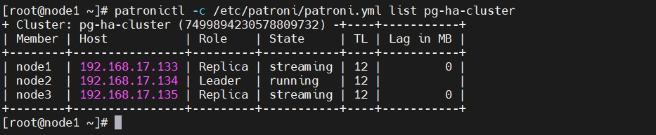
   
- patronictl restart the patroni cluster.
  ```
  patronictl -c /etc/patroni/patroni.yml restart pg-ha-cluster –force
  ```
- patronictl failover performs a manual failover in the cluster.
 ```
patronictl -c /etc/patroni/patroni.yml failover pg-ha-cluster --candidate node3  --force
```
  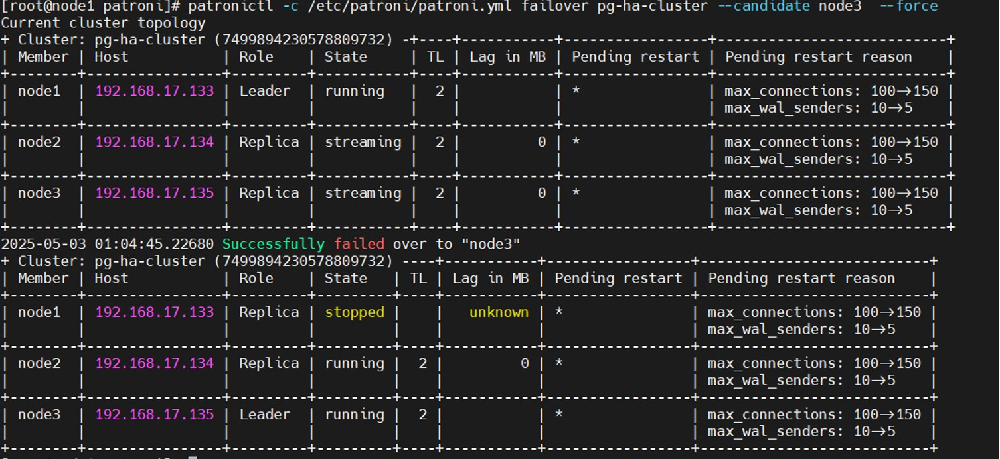

- patronictl switchover performs a manual switch-over in the cluster.

  ```
  patronictl -c /etc/patroni/patroni.yml switchover pg-ha-cluster --leader node3 --candidate node1
  ```
  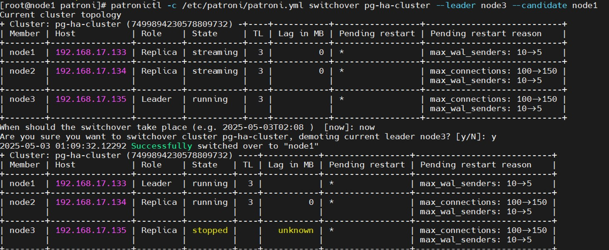

- patronictl query executes a SQL command or script against a member of the Patroni cluster.

  ```
  patronictl -c /etc/patroni/patroni.yml query pg-ha-cluster -U postgres --password -c "SELECT now()"
  ```
- Show PostgreSQL parameter.
  ```
  patronictl -c /etc/patroni/patroni.yml query pg-ha-cluster -U postgres --password -c "SHOW max_connections"
  ```
  
## 5.	HaProxy Setup

- #### Install following packages on haproxy server.
```
dnf install epel-release
dnf -y install haproxy
```

- #### Identify Primary and Standby endpoints through Patroni REST API
  - <strong>GET /master:</strong> primary health check endpoint. It returns HTTP status code 200 only when the Patroni node is in the state running and the role is primary with leader lock.
    
  - <strong>GET /replica:</strong> replica health check endpoint. It returns HTTP status code 200 only when the Patroni node is in the state running, the role is replica and noloadbalance tag is not set.

- #### Configure the haproxy.

  ```
  vi /etc/haproxy/haproxy.cfg
  ```

  ```
  global
        log         127.0.0.1 local2
        chroot      /var/lib/haproxy
        pidfile     /var/run/haproxy.pid
        maxconn     100
        user        haproxy
        group       haproxy
        daemon

        # turn on stats unix socket
        stats socket /var/lib/haproxy/stats

        # utilize system-wide crypto-policies
        ssl-default-bind-ciphers PROFILE=SYSTEM
        ssl-default-server-ciphers PROFILE=SYSTEM


  defaults
          mode tcp
          log global
          option tcplog
          retries 3
          timeout queue 1m
          timeout connect 4s
          timeout client 60m
          timeout server 60m
          timeout check 5s
          maxconn 100
  
  listen stats
          bind *:7000
          mode http
          stats enable
          stats uri /haproxy?stats
          stats realm HAProxy\ Statistics
          stats auth admin:admin123
          stats refresh 10s
  
  # write backend
  listen primary
          bind *:5000
          option httpchk OPTIONS /master
          http-check expect status 200
          default-server inter 3s fall 3 rise 2 on-marked-down shutdown-sessions
          server node1 192.168.17.133:5432 maxconn 100 check port 8008
          server node2 192.168.17.134:5432 maxconn 100 check port 8008
          server node3 192.168.17.135:5432 maxconn 100 check port 8008
  
  # read backned
  listen standby
          bind *:5001
          balance roundrobin
          option httpchk OPTIONS /replica
          http-check expect status 200
          default-server inter 3s fall 3 rise 2 on-marked-down shutdown-sessions
          server node1 192.168.17.133:5432 maxconn 100 check port 8008
          server node2 192.168.17.134:5432 maxconn 100 check port 8008
          server node3 192.168.17.135:5432 maxconn 100 check port 8008
  ```
  
- Start haproxy service and check the logs.
  ```
  systemctl enable haproxy
  systemctl start haproxy
  journalctl -xeu haproxy.service
  systemctl status haproxy
  ```
  
- Check haproxy status URL
  ```
  url: http://192.168.17.136:7000/haproxy?stats
  Will ask username and password
  Username: admin
  Password: admin123
  ```
  Then display the following status page:

  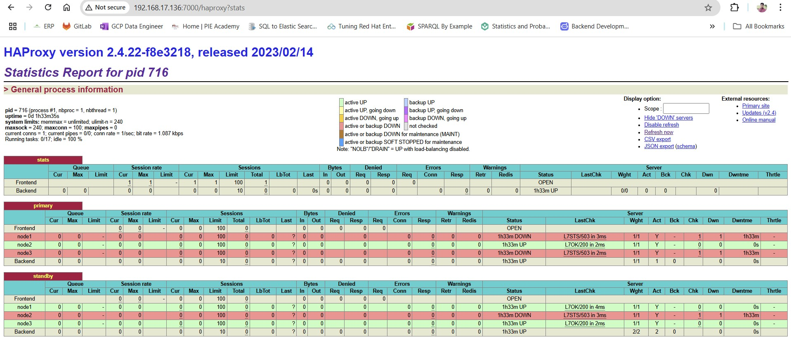

We will connect to primary backend for write operation and connect to standby backend for read operation from client application.</br>
- Write endpoint:
  ```
  psql -h 192.168.17.136 -p 5000 -d postgres -U postgres –password
  ```
- Read endpoint:
 ```
 psql -h 192.168.17.136 -p 5001 -d postgres -U postgres –password
 ```

## 6.	Test the Patroni

#### We will test the patroni cluster with write and read operation using the load balancer (haproxy).
- Write operation:
  ```
  psql -h 192.168.17.136 -p 5000 -d postgres -U postgres –password
  ```
  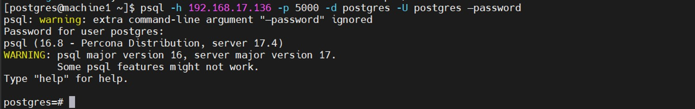 </br>
  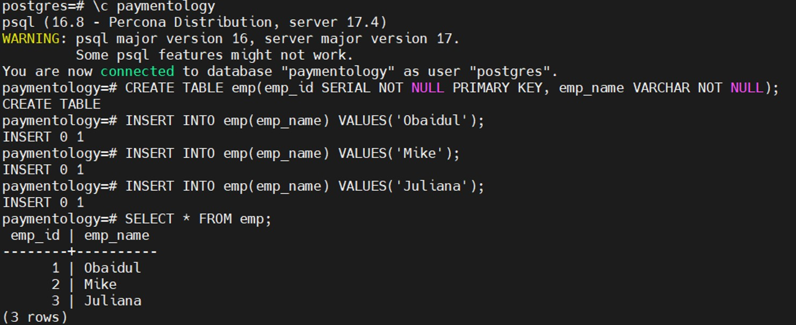 </br>
  
- Read operation:
  ```
  psql -h 192.168.17.136 -p 5001 -d postgres -U postgres –password
  ```
  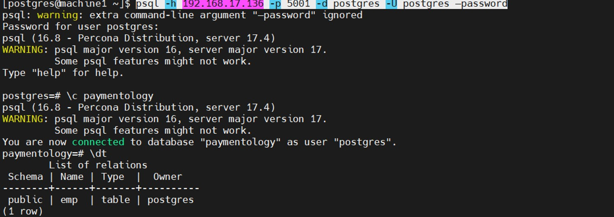
  </br>
  

## 7.	Setup of PgBackRest:
- I would recommend to follow the following URL to install and configure the pgbackrest tool and it will integrate with Patroni cluster.</br>
URL: https://github.com/obaidulsarker/postgresql-resources/blob/main/pgbackrest/pgbackrest-setup-manual.md

## 8.	Conclusion
Patroni simplifies the deployment and management of highly available PostgreSQL clusters. Its ability to automate key tasks such as failover and leader election ensures that database operations can continue with minimal interruption. A well-configured Patroni cluster provides a robust foundation for critical applications requiring continuous database availability.


