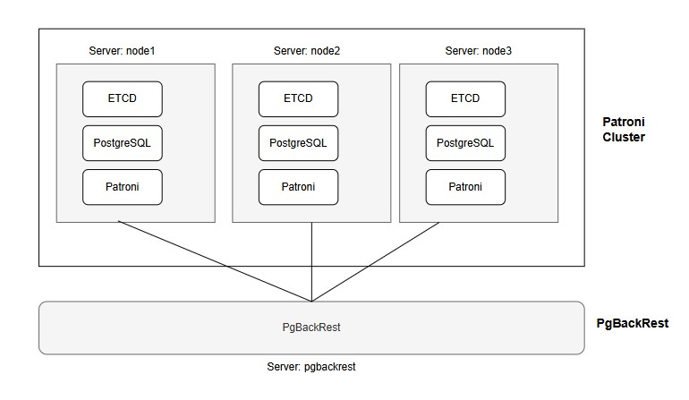
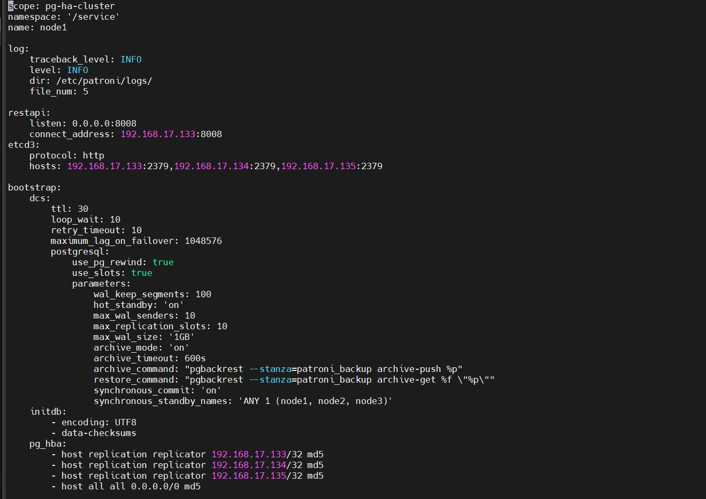
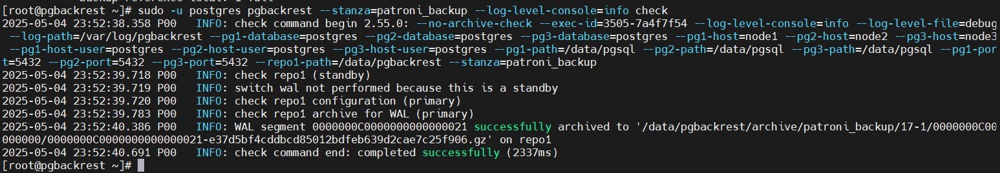
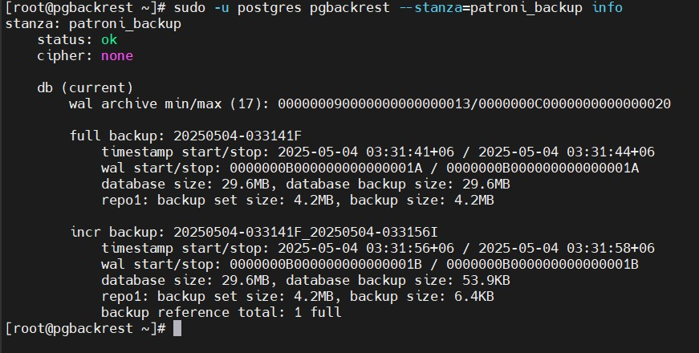

# PgBackRest Setup with Patroni Cluster

|Author: | MD OBAIDUL HAQUE SARKER |    
|:-----------|:-------------------------|
| Email:    | aupo37@gmail.com         |
| LinkedIn: | https://www.linkedin.com/in/md-obaidul-haque-sarker-5b983b26 |
| Github: | https://github.com/obaidulsarker |
| Created On: | 04-May-2025 |
| Updated On: | 05-May-2025 |

## 1.	Introduction
In a high-availability PostgreSQL environment managed by Patroni, robust backup and recovery strategies are essential. pgBackrest is a powerful and reliable backup and restore solution specifically designed for PostgreSQL. It addresses the limitations of traditional tools like pg_dump and tar by offering features like incremental backups, parallel processing, and efficient WAL (Write-Ahead Log) management. Integrating pgBackrest with Patroni ensures that backups are consistent and can be performed without disrupting database operations, thus minimizing downtime and data loss.

## 2.	Deployment Architecture


<center>Figure: Deployment diagram of PgBackRest</center>
</br></br>

- <strong>PostgreSQL Servers:</strong> The Patroni cluster nodes running the PostgreSQL database.
- <strong>Backup Repository:</strong> A dedicated storage location for pgBackrest backups. This can be either a network file system (NFS) or separate disk storage on a dedicated server.
- <strong>pgBackrest:</strong> Installed on each PostgreSQL node and potentially on a dedicated backup server.
- <strong>Patroni:</strong> Manages the PostgreSQL cluster and ensures high availability.

### Server Information
| Host Name|	IP Address|	OS	| Purpose |
|---------| ----------| ------| ----------|
| node1 |	192.168.17.133 |	AlmaLinux 9.5	| PostgreSQL, ETCD, Patroni, pgbackrest |
| node2	| 192.168.17.134	| AlmaLinux 9.5 |	PostgreSQL, ETCD, Patroni, pgbackrest |
| node3 |	192.168.17.135 |	AlmaLinux 9.5	| PostgreSQL, ETCD, Patroni, pgbackrest |
| pgbackrest |	192.168.17.137 |	AlmaLinux 9.5 |	pgbackrest |

### Service Information
| Service Name | version |	Port |	Purpose |
|-------------- | ------|-------- |-----------|
| ETCD |	3.5 |2379, 2380 |	2379 = Etcd client communication </br> 2380 = Etcd peer-to-peer communication (cluster members)  |
| Patroni REST API | 4.0 |	8008 |	REST API used by Patroni for health checks, failover, etc. |
| PostgreSQL | 17.4 |	5432 |	Main PostgreSQL database port |


## 3.	Backup Strategy
|Backup Method|	Backup Type|	Frequency| 	Retention Policy|	RTO|	RPO|
|-------------|-------------|-----------|-------------------|----|----|
|pgBackrest| 	Full	|Weekly|	4 backups|	10 minutes|	5 minutes|
|pgBackrest| 	Incremental|	Daily|	28 days|	10 minutes|	5 minutes|
|pgBackrest| 	WAL archive|	Continuous|	28 days|	10 minutes|	5 minutes|

  - RTO (Recovery Time Objective): This is the maximum acceptable time a database
system can be down after an outage. 
  - RPO (Recovery Point Objective): This defines the maximum acceptable amount of
data loss after a database system outage.</br>
  *** Assume that database size less is than 10GB.

## 4.	Installation and Configuration
### 4.1	Pre-requisites
  - Installed and configured the 3 nodes Patroni cluster. If it is not installed, please use following URL to install and confgure the patroni cluster:</br>
    https://github.com/obaidulsarker/postgresql-resources/blob/f8ad19ead6d9a7c278d20026e112d8238cff8241/patroni/patroni-setup-manual.md
  - Patroni cluster must be running.
  - A backup repository location with sufficient storage on dedicated backup server.
  - Network connectivity between Patroni nodes and the backup repository.
  - Update /etc/hosts on all servers.
  ```
  vi /etc/hosts
  ```
  ```
  192.168.17.133 node1
  192.168.17.134 node2
  192.168.17.135 node3
  192.168.17.137 pgbackrest 
  ```

 - #### Create postgres user on pgbackrest server.
   ```
   useradd postgres 
   passwd postgres 
   echo "postgres ALL=(ALL) NOPASSWD:ALL" >> /etc/sudoers
    ```
- #### Enable SSH trust among pgbackrest and all nodes of patroni cluster using postgres user.

  - On pgbackrest node, enable password less SSH authentication to all of patroni nodes.
    ```
    su – postgres
    ssh-keygen
    ssh-copy-id postgres@node1
    ssh-copy-id postgres@node2
    ssh-copy-id postgres@node3
    ```
  - On node1 of patroni cluster, enable password less SSH authentication to pgbackrest server.
    ```
    su – postgres
    ssh-copy-id postgres@pgbackrest
    ```
  - On node2 of patroni cluster, enable password less SSH authentication to pgbackrest server.
    ```
    su – postgres
    ssh-copy-id postgres@pgbackrest
    ```
  - On node3 of patroni cluster, enable password less SSH authentication to pgbackrest server.
    ```
    su – postgres
    ssh-copy-id postgres@pgbackrest
    ```
 ### 4.2 Install and Configure the PgBackRest

  - Install pgbackrest on all servers [pgbackrest, node1, node2 and node3].
    ```
    sudo dnf install -y epel-release
    sudo dnf install -y https://download.postgresql.org/pub/repos/yum/reporpms/EL-9-x86_64/pgdg-redhat-repo-latest.noarch.rpm
    sudo dnf -qy module disable postgresql
    sudo dnf install pgbackrest -y
    ```
- Take backup existing config file [/etc/pgbackrest.conf] if any, on all servers [pgbackrest, node1, node2 and node3].
  ```
  mv /etc/pgbackrest.conf /etc/pgbackrest.conf.bk
  ```
- Create following directories on all patroni nodes [node1, node2 and node3].
  ```
  sudo mkdir -p -m 770 /var/log/pgbackrest
  sudo chown postgres:postgres /var/log/pgbackrest
  sudo mkdir -p /etc/pgbackrest
  sudo mkdir -p /etc/pgbackrest/conf.d
  sudo touch /etc/pgbackrest/pgbackrest.conf
  sudo chmod 640 /etc/pgbackrest/pgbackrest.conf
  sudo chown postgres:postgres /etc/pgbackrest/pgbackrest.conf
  ```
        
- Create following directories on pgabckrest server.
  ```
  sudo mkdir -p /data/pgbackrest
  sudo mkdir -p /var/log/pgbackrest
  sudo chown postgres:postgres /data/pgbackrest
  sudo chown postgres:postgres /var/log/pgbackrest
  sudo chmod 750 /data/pgbackrest
  sudo mkdir -p /etc/pgbackrest
  sudo mkdir -p /etc/pgbackrest/conf.d
  sudo touch /etc/pgbackrest/pgbackrest.conf
  sudo chmod 640 /etc/pgbackrest/pgbackrest.conf
  sudo chown postgres:postgres /etc/pgbackrest/pgbackrest.conf
  ```
- Add following PostgreSQL parameters in /etc/patroni/patroni.yml file on node1, node2 and node3 servers
  ```
  vi /etc/patroni/patroni.yml
  ```
  ```
  archive_command: "pgbackrest --stanza=patroni_backup archive-push %p"
  archive_mode: "on"
  wal_level: “replica”
  max_wal_senders: “10”
  restore_command: "pgbackrest --stanza=patroni_backup archive-get %f \"%p\""
  ```
  Here, stanza name is “patroni_backup”.

  

- Alternatively, we can update PostgreSQL parameters using patronictl edit-config command on any of the patroni cluster and restart the patroni cluster.

  ```
  patronictl -c /etc/patroni/patroni.yml edit-config pg-ha-cluster --pg archive_command="pgbackrest --stanza=patroni_backup archive-push %p" –force
  patronictl -c /etc/patroni/patroni.yml edit-config pg-ha-cluster --pg restore_command="pgbackrest --stanza=patroni_backup archive-get %f \"%p\"" –force
  patronictl -c /etc/patroni/patroni.yml edit-config pg-ha-cluster --pg archive_mode="on" –force
  patronictl -c /etc/patroni/patroni.yml restart pg-ha-cluster –force
  patronictl -c /etc/patroni/patroni.yml list pg-ha-cluster
  ```

- Configure the /etc/pgbackrest/pgbackrest.conf on node1, node2 and node3 servers.
 
  ```
      vi /etc/pgbackrest/pgbackrest.conf
  ```
  ```
      [patroni_backup]
      pg1-path=/data/pgsql
      
      [global]
      repo1-path=/data/pgbackrest
      repo1-host=192.168.17.137
      repo1-host-user=postgres
  ```
  Here, "192.168.17.137" is the pgbackrest server's IP. </br>
  "/data/pgbackrest" is the repository location on pgbackrest server. Postgres user must have write access on repositroy directory.</br>
  "/data/pgsql" is the data directory of postgresql cluster.</br>
    
- Configure the /etc/pgbackrest/pgbackrest.conf file on pgbackrest server.
  ```
  vi /etc/pgbackrest/pgbackrest.conf
  ```
  ```
      [global]
      repo1-path=/data/pgbackrest
      repo1-retention-full=4
      repo1-retention-full-type=time
      repo1-host-user=postgres
      archive-check=n
      process-max=1
      log-level-console=info
      log-path=/var/log/pgbackrest
      log-level-file=debug
      start-fast=y
      delta=y
      compress-level=3
      
      [patroni_backup]
      pg1-host=node1
      pg1-host-user=postgres
      pg1-database=postgres
      pg1-path=/data/pgsql
      pg1-port=5432
      
      pg2-host=node2
      pg2-host-user=postgres
      pg2-database=postgres
      pg2-path=/data/pgsql
      pg2-port=5432
      
      pg3-host=node3
      pg3-host-user=postgres
      pg3-database=postgres
      pg3-path=/data/pgsql
      pg3-port=5432
  ```

- Restart the patroni service and list the cluster nodes on node1, node2 and node3 servers.

  ```
    systemctl restart patroni
    patronictl -c /etc/patroni/patroni.yml list pg-ha-cluster
  ```

- Create stanza on pgbackrest server.

  ```
  sudo -u postgres pgbackrest --stanza=patroni_backup --log-level-console=info stanza-create
  ```

- Check the configuration and the archiving process on pgbackrest server.

  ```
  sudo -u postgres pgbackrest --stanza=patroni_backup --log-level-console=info check
  ```
  

## 5.	Backup Procedure

  - Take full backup on pgbackrest server.
     ```
     sudo -u postgres pgbackrest --stanza=patroni_backup --type=full backup
     ```
     
  - Take incremental backup on pgbackrest server.
      ```
      sudo -u postgres pgbackrest --stanza=patroni_backup --type=incr backup
      ```
      
  - Check backup information on pgbackrest server.
    
    ```
    sudo -u postgres pgbackrest info
    ```

      
      
  - Add full and incremental backup schedule in cronjob on pgbackrest server.
      ```
      su – postgres
      crontab -e
      ```
      ```
      #!/bin/bash

      # Take full backup on every Saturday
      0 0 * * 0 pgbackrest --stanza=patroni_backup --type=full backup >> /data/pgbackrest/full-backups.log
      
      # Take incremental backup on every night
      0 0 * * * pgbackrest --stanza=patroni_backup --type=incr backup >> /data/pgbackrest/incremental-backups.log
      ```

## 6.	Restore Bakcup:
- The restore command automatically defaults to selecting the latest backup from the first repository where backups exist.
- To select from a specific repository, the --repo option can be passed (e.g. --repo=1).
- The --set option can be passed if a backup other than the latest is desired.
- When PITR of --type=time or --type=lsn is specified, then the target time or target lsn must be specified with the --target option.

- Identify the latest valid backup: Use the following command to view the available backups and identify the latest full and incremental backups on pgbackrest server.
    ```
    sudo -u postgres pgbackrest --stanza=patroni_backup info
    ```
    ```
    stanza: patroni_backup
    status: ok
    cipher: none

    db (current)
        wal archive min/max (17): 000000160000000000000036/0000001E0000000000000042

        full backup: 20250507-194113F
            timestamp start/stop: 2025-05-07 19:41:13+06 / 2025-05-07 19:41:16+06
            wal start/stop: 000000160000000000000036 / 000000160000000000000036
            database size: 36.9MB, database backup size: 36.9MB
            repo1: backup set size: 5.3MB, backup size: 5.3MB

        full backup: 20250512-235548F
            timestamp start/stop: 2025-05-12 23:55:48+06 / 2025-05-12 23:55:52+06
            wal start/stop: 0000001E0000000000000042 / 0000001E0000000000000042
            database size: 36.9MB, database backup size: 36.9MB
            repo1: backup set size: 5.3MB, backup size: 5.3MB

    ```
- To show detail of a backup (i.e. 20250512-235548F), use following command
  ```
  sudo -u postgres pgbackrest --stanza=patroni_backup --set=20250512-235548F info
  ```
  ```
  stanza: patroni_backup
    status: ok
    cipher: none

    db (current)
        wal archive min/max (17): 000000160000000000000036/0000001E0000000000000042

        full backup: 20250512-235548F
            timestamp start/stop: 2025-05-12 23:55:48+06 / 2025-05-12 23:55:52+06
            wal start/stop: 0000001E0000000000000042 / 0000001E0000000000000042
            lsn start/stop: 0/420000D8 / 0/420001D0
            database size: 36.9MB, database backup size: 36.9MB
            repo1: backup set size: 5.3MB, backup size: 5.3MB
            database list: paymentology (16389), postgres (5), test (24599)
  ```
  - If the database to restore is not known, use the info command set option to discover databases that are part of the backup set.
  - Stop the cluster and restore only the test database. Built-in databases (template0, template1, and postgres) are always restored.
    ```
    # sudo systemctl stop patroni
    # sudo -u postgres pgbackrest --stanza=patroni_backup --delta \
       --db-include=test --type=immediate --target-action=promote restore
    # sudo systemctl start patroni
    ```
  #### 6.1 Point-in-Time Recovery(PITR):
  Point-in-Time Recovery (PITR) allows the WAL to be played from a backup to a specified lsn, time, transaction id, or recovery point.

  - Take a full backup and list all backups info.
  ```
  sudo -u postgres pgbackrest --stanza=patroni_backup --type=full backup
  sudo -u postgres pgbackrest --stanza=patroni_backup info
  ```
  
  - Create an DATABASE on primary server and create a sample TABLE here.
    ```
    # su - postgres
    # psql
    # CREATE DATABASE test2;
    # \l
    # \c test2;
    # CREATE TABLE test(id SERIAL NOT NULL, sname VARCHAR(100));
    # INSERT INTO test(sname) VALUES('Obaidul Haque');
    # INSERT INTO test(sname) VALUES('Julian');
    # SELECT * FROM test;
    ```

  - Take incremental backup and list backup info.
    ```
     sudo -u postgres pgbackrest --stanza=patroni_backup --type=incr backup
     sudo -u postgres pgbackrest --stanza=patroni_backup info
    ```

  - Now we will DROP test2 DATABASE.
    ```
    # su - postgres
    # psql
    # SELECT current_timestamp;
    # DROP DATABASE test2;
    # \l
    ```
  - Turn off WAL restore_command (Reset) before point in time restoration
    ```
    # patronictl -c /etc/patroni/patroni.yml edit-config pg-ha-cluster --pg restore_command=""
    # patronictl -c /etc/patroni/patroni.yml restart pg-ha-cluster
    ```
  - Restore the demo cluster to "2025-05-05 15:37:03.157376+00"
    ```
    # sudo -u postgres pgbackrest --stanza=patroni_backup --delta \
       --type=time "--target=2025-05-05 15:37:03.157376+00" \
       --target-action=promote restore
    ```
  - Now check the recovered database (i.e. test2).
    ```
    # su - postgres
    # psql
    # \l
    ```

## 7.	Optimization to Avoid Impacting Primary Node Performance
- <strong> Backup from Standby:</strong> Configure pgBackrest to take backups from a standby node. This minimizes the load on the primary node and prevents performance degradation during backups.  The “backup-standby=y” or “backup-standby=prefer” setting in the “/etc/pgbackrest/pgbackrest.conf” file ensures this.
- <strong>Incremental Backups:</strong> Use incremental backups for frequent backups.  Incremental backups only copy the data that has changed since the last backup, which significantly reduces the I/O load.
- <strong>Parallel Processing:</strong> Utilize pgBackrest's parallel processing capabilities to speed up the backup process. The process-max setting in the “/etc/pgbackrest/ pgbackrest.conf” file controls the number of parallel processes. Adjust this value based on your server's resources.
- <strong>Compression:</strong> Compress the backups to reduce the amount of data that needs to be written to disk.  This can improve backup performance and reduce storage requirements.
   
## 8.	Conclusion
pgBackrest is a crucial component in a Patroni-managed PostgreSQL cluster. It provides the necessary tools to implement a comprehensive backup and recovery strategy. By enabling efficient, reliable, and non-disruptive backups, pgBackrest minimizes the risk of data loss and ensures business continuity. Its integration with Patroni simplifies the management of high-availability PostgreSQL deployments, allowing database administrators to focus on other critical tasks while having confidence in their backup and recovery capabilities.


    

